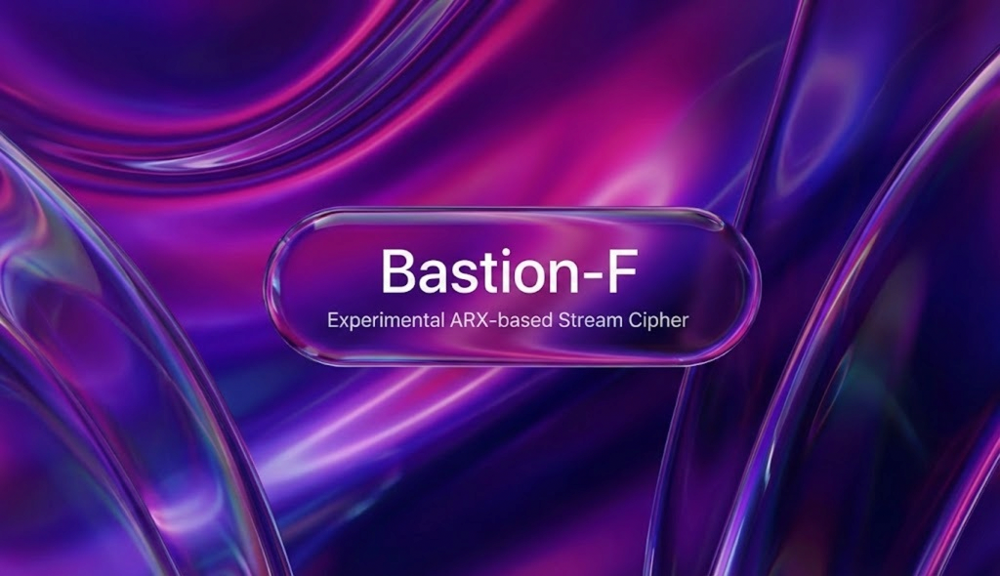

<p align="center">
  
</p>

<h3 align="center">
🛡️ Experimental ARX-based encryption • Cryptanalysis Wanted
</h3>


# 🛡️ Bastion-F

**Experimental ARX-based file encryption tool written in Rust.**
Custom cipher (Bastion-256). Open design. Cryptanalysis welcome.

---

## ⚠️ Cryptanalysis Wanted

Bastion-256 is an **experimental ARX-based stream cipher** designed for
educational and research purposes.

This project **actively invites cryptanalysis**.

We welcome:

* distinguishers from random
* reduced-round attacks
* key recovery attempts
* analysis of the key schedule and diffusion
* related-key or nonce-misuse analysis

**This is NOT production cryptography.**

---

## Building

This project is written in Rust and requires a recent stable toolchain.

Note that you can download compiled Bastion here: [Download Bastion.exe v0.0.2](https://github.com/Bastion-F/Bastion-F/releases/download/v0.0.2/bastion_f.exe)


### Requirements

* Rust 1.70+ (stable)
* Cargo

### Build

```bash
git clone https://github.com/Bastion-F/bastion-f.git
cd bastion-f
cargo build --release
```

The resulting binary will be located at:

```text
target/release/bastion-f
```

---

## Usage

Bastion-F is a local file encryption tool.

### Encrypt a file

```bash
bastion-f --encrypt --path secret.txt
```

This produces:

```text
secret.txt.bastion
```

### Decrypt a file

```bash
bastion-f --decrypt --path secret.txt.bastion
```

This restores:

```text
secret.txt.dec
```

### Optional secure deletion

```bash
bastion-f --encrypt --path secret.txt --shred
```

⚠️ Shredding is **best-effort only** and may not be reliable on SSDs or
log-structured file systems.

---

## Example

### Encryption

```text
$ bastion-f --encrypt --path notes.md
🛡️  Bastion-F v0.0.2 | Terminal
🔑 Enter a master-key: ********
⠁ Reading & Compressing... [00:00:00]
🗜️  Compression finished.
🔑 Keys derived safely.
⚙️  Encryption complete. [########################################] 100%
✍️  Digital signature added.
✅ DONE: notes.md.bastion
```

### Decryption

```text
$ bastion-f --decrypt --path notes.md.bastion
🛡️  Bastion-F v0.0.2 | Terminal
🔑 Enter a master-key: ********
⠁ Reconstructing keys... [00:00:00]
🔑 Keys reconstructed.
🛡️  Signature valid.
⚙️  Decryption complete. [########################################] 100%
🔓 File restored.
```

---

## Security Notes

* Bastion-256 is **not** a replacement for AES or ChaCha20
* The cipher has not undergone extensive public cryptanalysis
* Use for experimentation, learning, and research only

If you find a weakness, open an issue or contact the author.

**Breaking this cipher is considered a contribution.**
